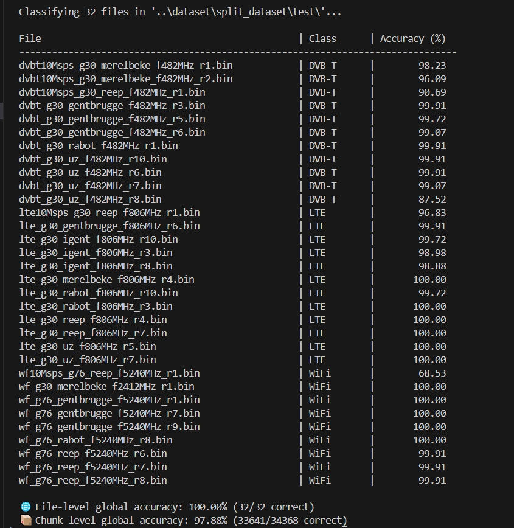
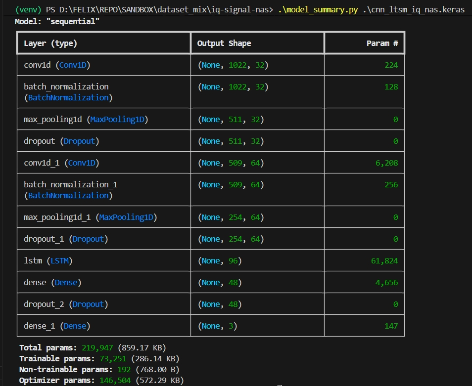
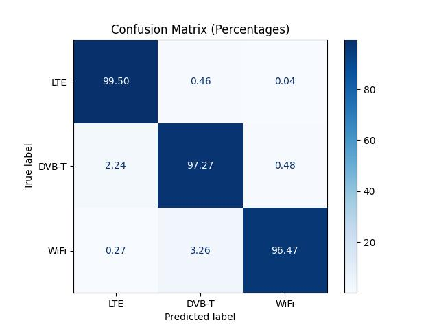
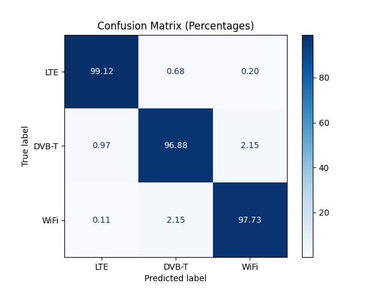

# 📡 Neural architecture Search on LTE_DVB_T_WiFi_small

This project implements a deep learning pipeline to classify wireless signals (LTE, DVB-T, WiFi) from raw IQ binary files.
The classification model is based on a hybrid CNN–LSTM architecture optimized with KerasTuner for neural architecture search (NAS).

Unlike traditional approaches based on Daubechies wavelets, this project originally explored custom-defined F-B-Spline (order 4) wavelets.
The current NAS version, however, works directly with normalized IQ chunks as input.


## ✨ Features of the Model
- Hybrid CNN–LSTM Network

    - Convolutional layers for extracting spatial features.
    - LSTM layer for capturing temporal dependencies in IQ sequences.

- Batch Normalization & Dropout
    - Ensures stable training and reduces overfitting.

- Configurable Training Parameters
    - Adjustable chunk size, batch size, and epochs via command-line arguments.

- Neural Architecture Search (NAS)
    - Uses keras-tuner to explore different hyperparameters (conv layers, filter sizes, LSTM units, learning rate, dropout).

- Incremental Training & Model Saving
    - Trained models are checkpointed and the best-performing configuration is stored.
---

## 🔄 Dataset Processing
1. **Binary file loading**:  
- .bin files contain interleaved float32 real and imaginary samples.
- Converted into complex IQ sequences.

2. **Normalization**:  
   - Each IQ sequence is standardized to zero mean and unit variance.

3. **Chunking with Wavelet Transform:**:  
- IQ data is split into fixed-length segments (chunk_samples).
- Each chunk is represented as a 2-column matrix: [real, imaginary].

4. **Labeling**:  
- Files are mapped to signal classes:
    - lte → LTE 
    - dvbt → DVB-T
    - wf → WiFi
- Labels are one-hot encoded for classification. 

---

## 📂 Dataset Structure
The dataset is organized into three folders following the rule (70% for training- 15% for validation - 15% for testing). The directory structure is this:
```text
├── nas_results
├── pictures
├── cnn_ltsm_iq_nas.keras --> This model is pretrained at 32 batch size and 1024 chunk samples and choosen during 10 trials!
├── confusion_matrix.py
├── model_summary.py
├── readme.md
├── requirements.txt
├── test_iq_nas.py
└── train_iq_nas.py
```
Remember the folder as dataset must be organized like this.
- **train/** → used for training the model  
- **validation/** → used for tuning and preventing overfitting  
- **test/** → used for final evaluation  

---

## ▶️ How to Train

Create a Python Enviroment
```bash
    python -m venv venv
```
Activate the Python Enviroment on Windows PowerShell
```bash
    .\venv\Scripts\activate.bat
```
Activate the Python Enviroment on Linux
```bash
    source venv/bin/activate
```
Install Dependencies First!
```bash
    pip install -r requirements.txt
```

You can run the following script to start the training process. But you might like to explore the script and maybe make some adjustments.
```bash
    python train_iq_nas.py <model.keras> <dt_folder> <chunk_samples> <batch_size> <epochs>

```

## ▶️ How to Test the pre-trained model!
If you already applied some training to the model, you can go to the last step for testing the model `python train_iq_nas.py best_model.keras ./dataset 1024 32 6`, because you did  create the enviroment and activate it successfully.

- chunk_samples = 1024
- batch_size = 32
- epochs = 6
- max_trials (NAS) = 10

Create a Python Enviroment
```bash
    python -m venv venv
```
Activate the Python Enviroment on Windows
```bash
    .\venv\Scripts\activate.bat
```
Activate the Python Enviroment on Linux
```bash
    source venv/bin/activate
```
Install Dependencies First!
```bash
    pip install -r requirements.txt
```

You can run the following script to start the test process. 
```bash
    python test_iq_nas.py best_model.keras ./dataset/test 1024
```
### ▶️ Test result for 32 Batch Size Model (NAS Trained Model)


## ▶️ How to Check the Model Summary!
If you want to check how is built the current model or just next training process, you might find this script useful!
This value is the same for both models included in this repository.
```bash
    python model_summary.py cnn_ltsm_iq_nas.keras
```



## 📊 Results from NAS Experiment

Training setup: 1024 chunks, batch size = 32, epochs = 6, 10 NAS trials.

The best model was selected automatically based on validation accuracy.

## Confusion Matrix Analysis (with percentages)


#### Confusion Matrix Percentage Values for 32 batch size model (NAS Trained Model)



#### Confusion Matrix Percentage Values from Repo LTE_DVB_T_WiFi_small_model


| Accuracy Metric     | **LTE_DVB_T_WiFi_small Model**                       | **NAS Trained Model model**                                                            |
| ------------------- | ------------------------------------- | ----------------------------------------------------------------------- |
| **LTE (Correct)**   | 99.12%                                | **99.50% 🥇**                                                           |
| **DVB-T (Correct)** | 96.88%                                | **97.27% 🥇**                                                           |
| **WiFi (Correct)**  | **97.73% 🥇**                         | 96.47%                                                                  |
| **Main Error**      | Minor confusion DVB-T ↔ WiFi (~2.15%) | Significant confusion of WiFi as DVB-T (3.26%) and DVB-T as LTE (2.24%) |

### Communication-friendly summary
The NAS Trained model is slightly more accurate overall, particularly for the DVB-T class. However, the "small_model" is more robust and makes fewer significant misclassification errors between different signal types. The choice of which model is "better" depends on the specific priorities of your application. If correctly identifying DVB-T and LTE signals is the most critical metric, the "32" model is preferable. If minimizing confusion between signal types is more important, the "small_model" would be the better choice.

# About NAS on LTE_DVB_T_WiFi_small
- NAS means Neural architecture Search.
- Training parameters: 6 epochs, chunk_samples=1024, batch sizes tested: 32, Trials: 10
- The final selected model provides a balanced and reliable performance for multi-class signal classification.